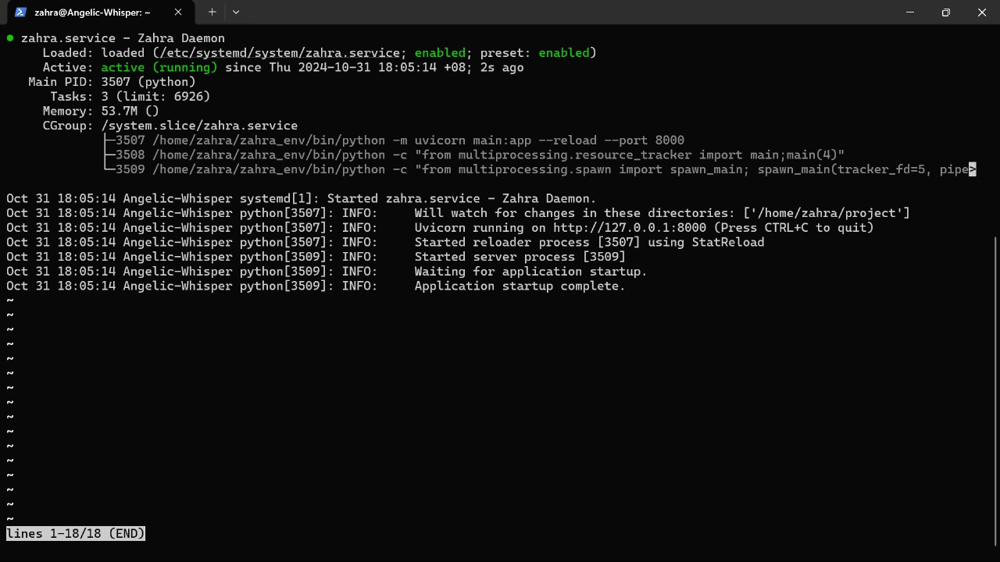

# Panduan pembuatan dameon process
NIM: F1G123016 
Nama:  Wa Ode Zahra Ramadani

Pada tulisan ini saya akan memaparkan tahapan pembuatan daemon process

## Buat file .service
masuk sebagai superuser, lalu jalankan perintah
```bash
$ sudo touch /etc/systemd/system/zahra.service
```

## Penulisan script konfigurasi .service

```bash
[Unit]
Description=Zahra Daemon

[Service]
User=zahra
Restart=always
WorkingDirectory=/home/zahra/project
Environment="PYTHONPATH=/home/zahra/zahra_env/lib/python3.12/site-packages"
ExecStart=/home/zahra/zahra_env/bin/python -m uvicorn main:app --reload --port 8000

[Install]
WantedBy=multi-user.target
```

## jalankan perintah daemon
```bash
$ sudo systemctl daemon-reload 
$ sudo systemctl enable zahra.service 
$ sudo systemctl start zahra.service
```

## Bukti daemon telah berjalan
